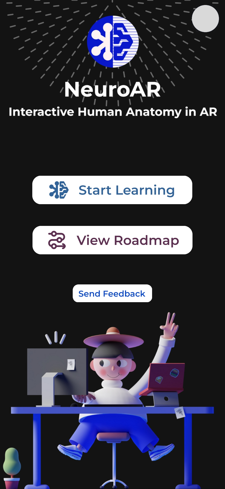
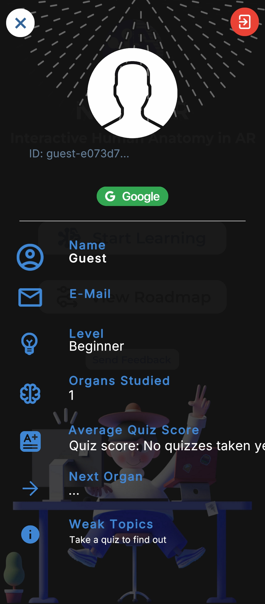
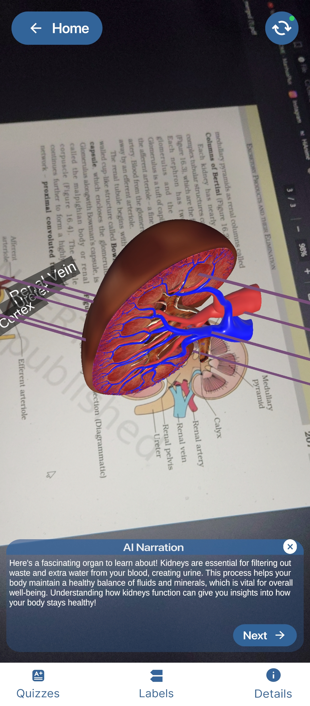
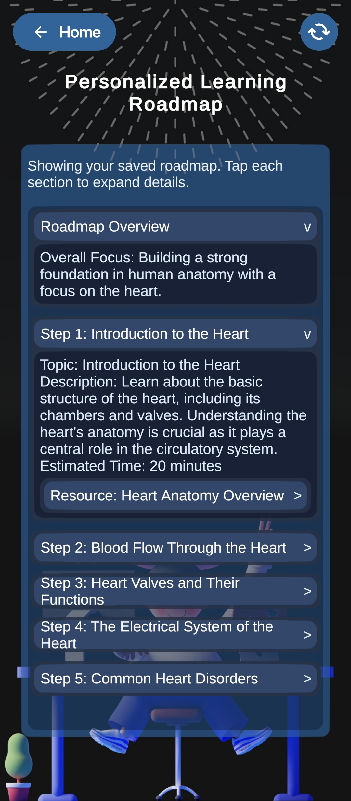
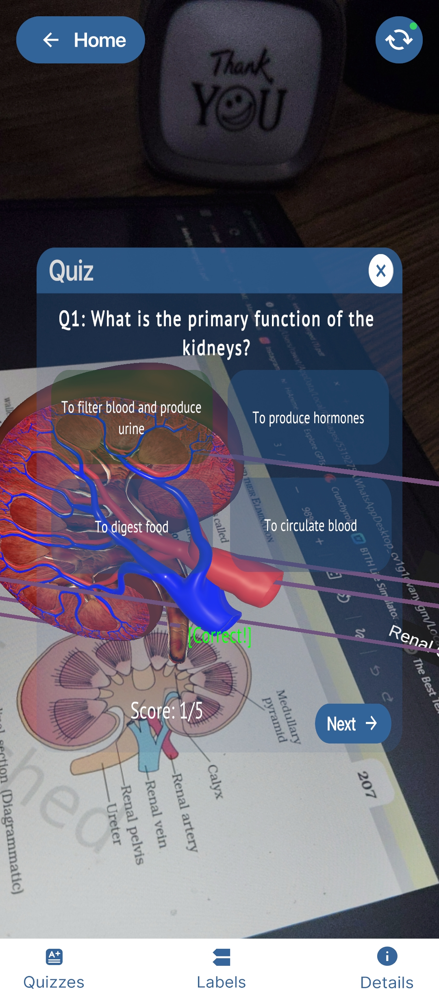
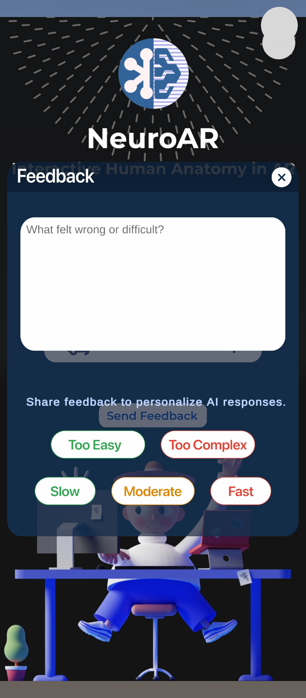

# NeuroAR - Adaptive Educational Augmented Reality Platform

NeuroAR is an educational AR learning experience that combines textbook-based organ visualization with adaptive AI tutoring, quizzes, and personalized roadmap generation.

The system is built with a Unity front end and a Node.js backend, enabling real-time interaction on device and persistent learner intelligence in the cloud.

---

## Visual Preview

### Planned Screenshot Placeholders

<table>
  <tr>
    <td align="center"></td>
    <td align="center"></td>
    <td align="center"></td>
  </tr>
  <tr>
    <td align="center"><b>Dashboard</b></td>
    <td align="center"><b>Profile</b></td>
    <td align="center"><b>AI-Narration</b></td>
  </tr>
  <tr>
    <td align="center"></td>
    <td align="center"></td>
    <td align="center"></td>
  </tr>
  <tr>
    <td align="center"><b>Roadmap</b></td>
    <td align="center"><b>Quiz</b></td>
    <td align="center"><b>Feedback</b></td>
  </tr>
</table>

---

## Repository Structure

~~~text
NeuroAR/
|
|-- README.md
|-- docs/
|   |-- architecture.md
|   |-- system-architecture.md
|   `-- images/
|
|-- Assets/
|   |-- Scenes/
|   |-- Scripts/
|   |   |-- Agent1/
|   |   |-- Agent2/
|   |   |-- Agent3/
|   |   |-- Feedback/
|   |   |-- Login/
|   |   `-- RoadmapScene/
|   |-- Prefabs/
|   `-- Resources/
|
|-- Backend/
|   |-- server.js
|   |-- agents.js
|   |-- db.js
|   |-- schema.json
|   |-- state.js
|   `-- package.json
|
|-- Packages/
`-- ProjectSettings/
~~~

---

## Project Overview

| Property | Details |
|----------|---------|
| Engine | Unity 6 |
| AR Stack | Vuforia + AR Foundation |
| Platform | Android |
| Language | C# (Unity), JavaScript (Backend) |
| Backend | Node.js + Express |
| AI Runtime |OpenAI LLM through LangChain |
| Database | MongoDB |
| Domain | Educational AR Anatomy |

---

## High-Level System Architecture

~~~mermaid
flowchart LR
    U[Student Device] --> L[Login Scene]
    L --> S[Start Scene]
    S --> M[3D Anatomy Scene]
    S --> R[Roadmap Scene]

    subgraph UNITY[Unity Client]
      US[UserSession]
      PM[LearnerProfileManager]
      NM[NarrationManager and NarrationService]
      QZ[QuizUI and QuizService]
      RM[RoadmapUI and RoadmapService]
      FB[FeedbackService]
    end

    subgraph API[Node.js Express Backend]
      SRV[server.js API]
      AG[agents.js]
      DB[db.js]
      MDB[(MongoDB)]
      LLM[(OpenAI LLM)]
    end

    L --> US
    US --> PM
    M --> NM
    M --> QZ
    R --> RM
    S --> FB

    PM -->|profile and progress endpoints| SRV
    NM -->|narration endpoint| SRV
    QZ -->|question and submit endpoints| SRV
    RM -->|roadmap endpoints| SRV
    FB -->|feedback endpoint| SRV

    SRV --> AG
    SRV --> DB
    AG --> LLM
    DB --> MDB
~~~

---

## Four-Agent Adaptive Learning System

| Agent | Purpose | Trigger |
|------|---------|---------|
| Agent 1 | Learner profile evaluation and recommendation summary | Organ log and quiz submission |
| Agent 2 | Personalized narration generation | Organ learning interaction |
| Agent 3 | Adaptive MCQ quiz generation | Quiz start |
| Agent 4 | Personalized roadmap generation | Roadmap scene open or refresh |

---

## Core Runtime Components

| Component | Responsibility |
|----------|----------------|
| UserSession | Keeps identity and auth context across scenes |
| LearnerProfileManager | Loads profile and publishes adaptive summary state |
| NarrationManager and NarrationService | Builds context and fetches adaptive narration |
| QuizUI and QuizService | Requests and submits adaptive quizzes |
| RoadmapUI and RoadmapService | Retrieves cached roadmap or triggers generation |
| FeedbackService | Sends telemetry and bounded preference actions |

---

## API Surface

### Profile and Progress
- POST /api/profile/load
- POST /api/profile/save
- GET /api/profile/:userId
- POST /api/organ/log
- POST /api/quiz/submit

### Agent Endpoints
- POST /api/agent/narrate
- POST /api/agent/question
- GET /api/agent/roadmap-existing-or-generate/:userId
- GET /api/agent/roadmap/:userId

### Feedback and Prompt Context
- POST /api/feedback
- GET /api/feedback/logs/:userId
- GET /api/profile/:userId/learning-preferences
- GET /api/agent/prompt-context/:userId

### Health
- GET /health

---

## Getting Started

### Prerequisites
- Unity Editor 6000.3.7f1
- Node.js 18+
- MongoDB instance
- Azure OpenAI resource access

### 1) Open the Unity Project
1. Clone this repository.
2. Open the folder in Unity Hub.
3. Select Unity 6000.3.7f1.
4. Let packages and assets import fully.

### 2) Run the Backend
~~~bash
cd Backend
npm install
npm run dev
~~~

Backend default runs on port 8080 unless PORT is configured.

### 3) Configure Environment Variables
Create a .env file inside Backend with:

~~~env
MONGODB_URL=your_mongodb_connection_string
MONGODB_DB_NAME=your_database_name
MONGODB_COLLECTION_USERS=users
MONGODB_COLLECTION_VECTORS=vectors
MONGODB_VECTOR_INDEX=vector_index

AZURE_OPENAI_API_KEY=your_azure_openai_api_key
AZURE_OPENAI_ENDPOINT=https://your-resource.openai.azure.com/
AZURE_OPENAI_API_VERSION=2024-02-15-preview
AZURE_OPENAI_DEPLOYMENT=your_deployment_name

HUGGINGFACEHUB_API_TOKEN=your_hf_token
HUGGINGFACE_EMBEDDING_MODEL=sentence-transformers/all-MiniLM-L6-v2

PORT=8080
~~~

---

## Learning Flow

1. User signs in as guest or Google account.
2. Profile is loaded or created from backend.
3. User studies organ in AR scene.
4. Agent 2 returns adaptive narration.
5. Agent 3 returns adaptive quiz.
6. Quiz submission updates profile and recalculates Agent 1 summary.
7. Agent 4 serves cached roadmap or regenerates based on latest profile.

---

## Design Principles

- Modular scene architecture
- Data-driven learner model
- Bounded preference controls for safe personalization
- JSON-structured AI outputs for stable parsing
- Cache-first roadmap strategy for cost and latency control

---

## Future Enhancements

- Markerless AR exploration mode
- Voice narration and multilingual support
- Teacher dashboard and cohort analytics
- Expanded organ library and advanced quiz modes
- CI test automation for backend routes

---

## Documentation

- docs/system-architecture.md
- docs/architecture.md
- feedback-system-schema.md

---

## Contributing

1. Fork the repository.
2. Create a feature branch.
3. Commit focused, tested changes.
4. Open a pull request with clear context and screenshots.

---

If this project helps you, consider starring the repository.
